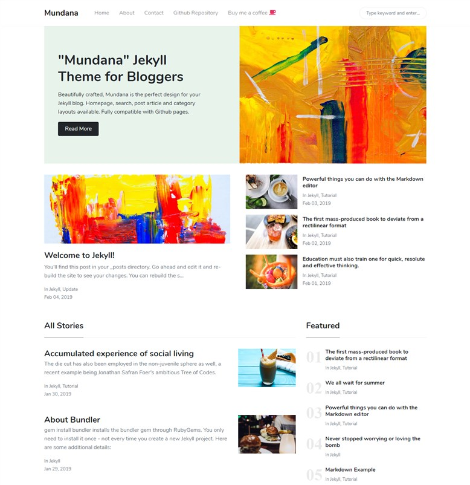

# Jekyll Theme - Mundana by WowThemes.net

[Blog](https://wowthemesnet.github.io/mundana-theme-jekyll/) &nbsp; &nbsp;&nbsp;&nbsp; | &nbsp;  
[Documentation](https://bootstrapstarter.com/mundana-theme-jekyll/) &nbsp; | &nbsp; 

### Contribute to the Data Nerdz blog:

1. In the top-right corner of this page, click **Fork**.

2. Clone a copy of your fork on your local, replacing *YOUR-USERNAME* with your Github username.

   `git clone https://github.com/YOUR-USERNAME/Datanerdz.git`

3. **Create a branch**: 

   `git checkout -b <new-post>`

4. **Make necessary changes, add new posts as markdown and commit those.**:

   `git add .`

   `git commit -m "New post name and small descript 5-10 words"`

5. **Push changes**, replacing `<add-your-branch-name>` with the name of the branch you created earlier at step #3. :

   `git push origin <add-your-branch-name>`

6. Submit your changes for review. Go to your repository on GitHub, you'll see a **Compare & pull request** button. Click on that button. Now submit the pull request.

That's it! Soon I'll be merging your changes into the master branch of this project. You will get a notification email once the changes have been merged. Thank you for your contribution.

   

### Copyright

Copyright (C) 2022 Bimal Parajuli.

This blog is maintained by [Bimal](https://github.com/bimal-parajuli/)

### Live Demo

[Live Demo](https://wowthemesnet.github.io/mundana-theme-jekyll/)
