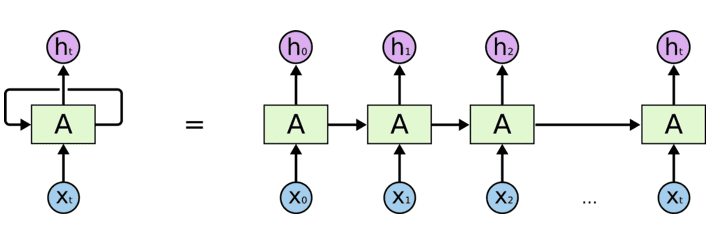
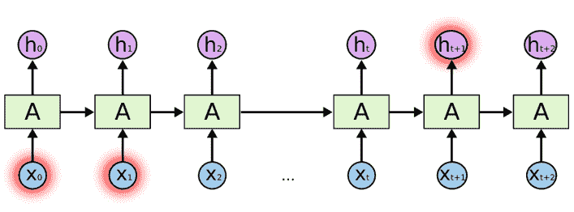
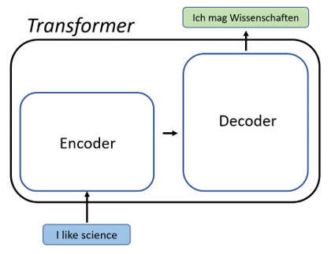
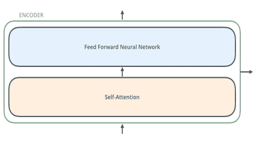
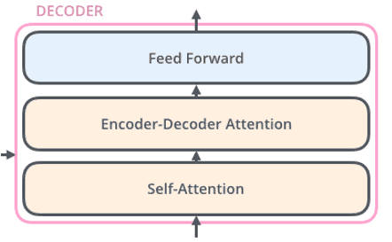
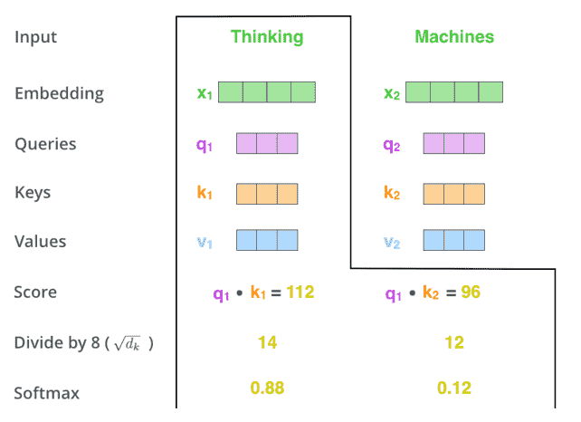

**Transformers**: Before we start with transformers, we must ask why transformers are used? 
 

To answer this question, we must start with Recurrent Neural Network (RNN) which repeats itself after some period. A RNN can be shown as,

**`Figure 1: RNN Folded and Unfolded`**

RNN are useful in cases where you want the results of predictions to be used in future e.g., intent of sentences for language translation, chat bot applications etc. But RNN becomes ineffective if the gaps in relevant information are large as information will get lost in the chain longer the chain goes.
E.g., to predict the next stock price at any point, it may require calculating previous stock prices at previous time.

**`Figure 2 Information at Ht+1 requires information at time x0 and x1`**

Although RNN could learn these long-time dependencies, in practice they don’t. To overcome this issue Transformer is used.
Transformer is a semi-supervised machine learning algorithm that uses the mechanism of self-attention, by weighing significance of each generated data. They are useful in fields which require sequential input data output like NLP, Computer Vision etc. and when working with any time series data.
Transformers allow parallelism as they do not process the entire data at once, which reduces training time. First introduced in 2017 and they are becoming a popular choice for NLP problems, replacing RNN and LSTM (Long-Term Short Memory).

A transformer has a simple flow, input, encoding, decoding and output.

**`Figure 3 Use of transformer for language translation`**

Each encoder layer generates encodings about information relevant with parts of the input and passes it forward using a feed forward. 
The decoder does the opposite, it takes all the generated encodings and using the contextual information present in the encodings presents the output. 
A single transformer will have multiple encoder and decoder layers and it does so by using a mechanism called Attention.

 

**`Fig 4: Internal Structures of Encoder`**.

 

**`Fig 5: Internal Structures of Decoder.`**

Understanding Self-Attention
Transformers are built using scaled dot-products. When a sequence is passed to a transformer model, attention weights are calculated between every token simultaneously which provides encoding for the information present in the token along with weighted combination of relevant tokens by their attention weights.

The transformer learns two weight matrices Wk the key weights and WQ the query weights and WV the value weights, for each token i, word embedding is used to convert xi into three vectors,

Query vector q_i=x_i * W_Q,  
Key vector &nbsp; &nbsp; k_i=x_i * W_K  
Value vector &nbsp; v_i=x_i * W_V.

Attention weights is then calculated as a product of query and key vectors and divided by the square root of dimensions of key vectors √(d_k )  and passed through a softmax layer to normalize the weights. 
So, the attention is given by,
 

**`Figure 6: Self-Attention Working`**

Transformers can also pay attention to multiple dimensions. Multiple attention heads for different tokens can add more level of relevance and can encode relations relevant to humans.

